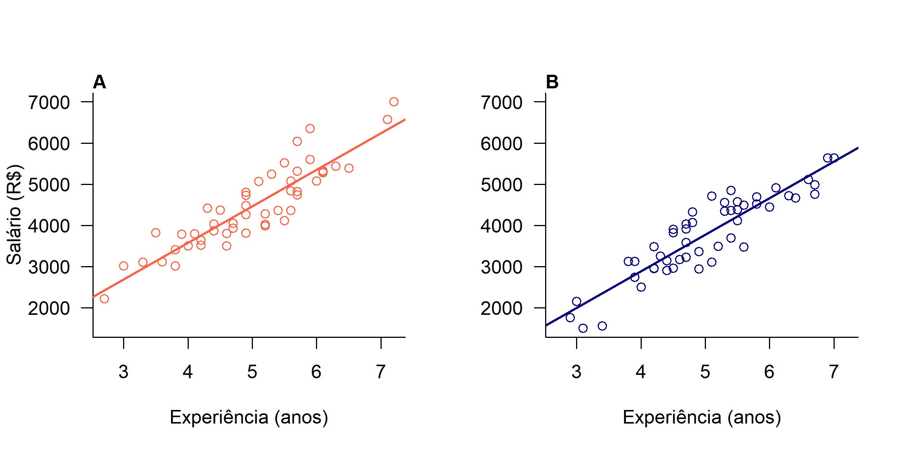
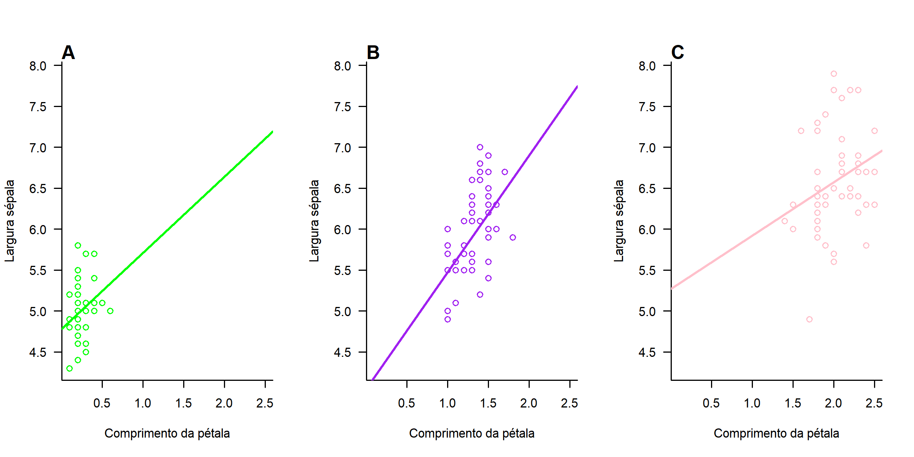

Análise explanatória de dados é importante 

```{r Introdução ao R-Marckdown, include=FALSE}
knitr::opts_chunk$set(echo = TRUE)
```

## Relatório: Aula 07

Redigindo o script utilizando o R Marckdown  

```{r Salários de homens e mulheres}
# Aula 07: Gráficos

#Dados utilizados

sal <- read.csv("https://raw.githubusercontent.com/AndreaSanchezTapia/analise_de_dados_ENBT_2019/master/aula07/data/salarios.csv")

#Dispersão
#plot com "abline" do modelo de regressão

head(sal)
summary(sal)

# criando objetos e modelos lineares para auxiliar a construção do gráfico

mh <- lm(salario ~ experiencia, data=sal[sal$sexo=="H",])
mm <- lm(salario ~ experiencia, data=sal[sal$sexo=="M",])
coefh <- coef(mh)
coefm <- coef(mm)

#lendo o objeto para eu entende porque criei um:
mh
mm
coefh
coefm

# definindo os limites dos eixos no R base
limy <- c(min(sal$salario),max(sal$salario)) #adicionando os valores limites no eixo y
limx <- c(min(sal$experiencia),max(sal$experiencia)) #adicionando os valores limites no eixo x
## definindo os nomes dos eixos no R base
labx <- "Experiência (anos)" #adicioando legenda no eixo x
laby <- "Salário (R$)" #adicionando legenda no eixo y

# define parametros graficos
par(mfrow=c(1,2), las=1, bty="l") #aqui estamos usando las (colocar os valores do eixo y para a horizontal) e bty (formato do gráfico em em caixa, mas em "L") dentro do par para fixar para todas as janelas
# plot dos valores de salario dos homens
plot(salario ~ experiencia, data=sal[sal$sexo=="H",],
     col="tomato",
     ylim=limy, xlim=limx,
     ylab=laby, xlab=labx) #plotando os gráficos com os objetos criados anteriormente
# linha do previsto pelo modelo
## a + b.x
abline(a=coefh[1], b=coefh[2],
       col='tomato', lwd=2) #adicionando os coificientes na reta do gráfico; para as demais funções verificar lista do R
mtext("A", 3, adj=0, font=2) #mtext: corresponde a lengenda da imagem (e.g., Gráfico A, Gráfico B...)
## plot do salario das mulheres
plot(salario ~ experiencia, data=sal[sal$sexo=="M",],
     col="navy",
     ylim=limy, xlim=limx,
     ylab="", xlab=labx)
mtext("B", 3, adj=0, font=2)
# linha do previsto pelo modelo
## a + b*x
abline(a=coefm[1], b=coefm[2],
       col='navy', lwd=2)

#Queremos exportar esse gráfico. Para isso, primeiro crie um diretório /figs em seu repositório. Para exportar o gráfico vamos usar a função png, especificando a resolução e dimensões da figura. Quando criamos gráficos com a função png o que fazemos é:

#anunciar qual extensão e arquivo vamos plotar o gráfico com a função png()

#determinar a sequência de comandos que cria o gráfico

#finalizar a construção do arquivo com a função dev.off()

# a funcao png cria o arquivo, daqui pra frente você não vai mais ver o gráfico
png("../Data/Figs/figura01.png", res=300, width=2400, height=1200)
# define parametros graficos
par(mfrow=c(1,2), las=1, bty="l") # aqui estamos usando las e bty dentro do par para fixar para todas as janelas
# plot dos valores de salario dos homens
plot(salario ~ experiencia, data=sal[sal$sexo=="H",],
     col="tomato",
     ylim=limy, xlim=limx,
     ylab=laby, xlab=labx)
# linha do previsto pelo modelo
## a + b*x
abline(a=coefh[1], b=coefh[2],
       col='tomato', lwd=2)
mtext("A", 3, adj=0, font=2)
## plot do salario das mulheres
plot(salario ~ experiencia, data=sal[sal$sexo=="M",],
     col="navy",
     ylim=limy, xlim=limx,
     ylab="", xlab=labx)
mtext("B", 3, adj=0, font=2)
# linha do previsto pelo modelo
## a + b*x
abline(a=coefm[1], b=coefm[2],
       col='navy', lwd=2)
# para finalizar o gráfico e gerar o arquivo, precisamos rodar o dev.off()
dev.off()
## png
##   2

```

## Gráficos gerados 


```{r Regressão linear, echo=FALSE}



```


## Exercício 

Relações entre larguras de sépala e comprimento de pétalas de três espécies de *Iris* sp. 

```{r Relação das sépalas e pétalas de Iris}




```

## Referências 
